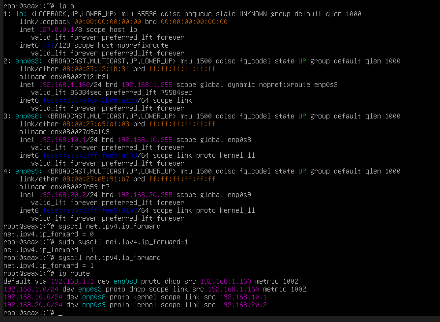

1. Infraestructura y Encaminamiento 

---

La infraestructura es el esqueleto; el encaminamiento (routing) es el sistema nervioso que decide por dónde viaja la información.

* Teoría Clave:

Modelo OSI: Céntrate en la Capa 2 (Enlace) y Capa 3 (Red).

Segmentación (VLANs): Fundamental para la seguridad; no quieres que los invitados de la Wi-Fi vean el servidor de contabilidad.

Protocolos de Enrutamiento: Diferencia entre estático (tú dices por dónde ir) y dinámico (protocolos como OSPF para redes internas o BGP para Internet).

* Parte Práctica Sugerida:

Diseña una topología con dos routers y tres subredes distintas.

Configura enrutamiento estático y luego OSPF para demostrar cómo la red se recupera si un enlace falla.

Documentación: Capturas de las tablas de enrutamiento (show ip route) y pruebas de ping entre redes.

---

Fundamento Teorico:

Modelo de capas: En este nivel trabajamos principalmente en la Capa 3 (red) del modelo OSI. Protocolo estrella IP.

IP forwarding: Por defecto, un sistema Linux descarta los paquetes que recibe y que no van dirigidos a el. Para que funcione como router, debemos activar el reenvio de paquetes a nivel de Kernel.

Tablas de encaminamiento: Es la "hoja de ruta" que el sistema consulta, esta contiene:
* Red de destino: a donde quermos ir.
* Mascara de red: Define el tamaño del segmento.
* Gateway (puerta de enlace): El siguiente salto (el proximo router).
* Interfaz: Por que tarjeta de red () debe salir el dato.


Parte practica:

Supongamos el siguiente escenario:
* Red A: 192.168.10.0/24
* Red B: 192.168.20.0/24
* Router Debian: Tendra dos tarjetas de red (una en cada red).

Paso 1: Configuracion de interficies

En la VM "Router", editamos el archivo de red:
```
sudo nano /etc/network/interfaces
```
Configuramos las dos IPs (una para cada subred):
```
auto eth0
iface eth0 inet static
    address 192.168.10.1
    netmask 255.255.255.0

auto eth1
iface eth1 inet static
    address 192.168.20.1
    netmask 255.255.255.0
```

Paso 2: Activacion del Forwarding

Para que Debian deje pasar paquetes de eth0 a eth1, activa el reenvío de IPv4:
```
sudo sysctl -w net.ipv4.ip_forward=1
```

Para que el forwarding quede permanente y no se desactive al reiniciarse la maquina debemos editar el archivo "/etc/sysctl.conf" y descomentar la linea "net.ipv4.ip_forward=1"

Paso 3: Encaminamiento dinamico con FRRouting

Para no usar rutas estaticas instalaremos FRR (Free Range Routing), que es el estandard en linux para protocolos profesionales como OSPF.

- Instalar FRR: 
```
sudo apt install frr
```
- Habilitar el dominio OSPF en /etc/frr/daemons cambiando ospfd=no a ospfd=yes.
- Reiniciamos el servicio:
```
sudo systemctl restart frr
```
- Entrar a la consola de configuracion (estilo Cisco): 
```
sudo vtysh
```
Dentro de la consola ejecutar:
```
conf t
router ospf
 network 192.168.10.0/24 area 0
 network 192.168.20.0/24 area 0
exit
```

Verificacion y Documentacion 

Paso 1: Verificacion en el Router 
Estado de las interficies:
```
ip addr 
```
Deberian verse las IPs configuradas y ambas con un state UP

Forwarding
```
sysctl net.ipv4.ip_forward
```
Deberia dar como resultado "net.ipv4.ip_forward = 1", sino es que el forwading esta desactivado y hace falta activarlo.

Tabla de rutas:
```
ip route
```
Deberian aparecer las rutas "conected" para ambos segmentos.



Paso 2: Configuracion y Verificacion en los clientes
Los clientes deben saber que para ir a otra red tienen que pasar por el Router.

En la VM cliente A (Red 10):
* IP: 192.168.10.0
* Mascara: 255.255.255.0
* Gateway: 192.168.10.1 (La IP del router en esa red).

En la VM Cliente B (Red 20):
* IP: 192.168.20.0
* Mascara: 255.255.255.0
* Gateway: 192.168.20.2 (La IP del router en esa red).

Paso 3: Conectividad
Vamos a hacer ping desde el Cliente A al Cliente B.

```
ping -c 4 192.168.20.0
```
Si el ping funciona, haz un `traceroute` (instálalo con `sudo apt install traceroute` si no lo tienes):
    
```
traceroute 192.168.20.0
```
Lo que verás: El primer salto será `192.168.1.0` (tu router) y el segundo será el destino final.
