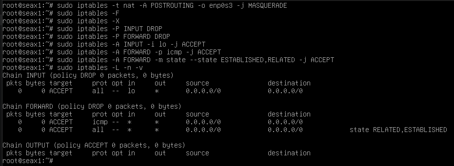
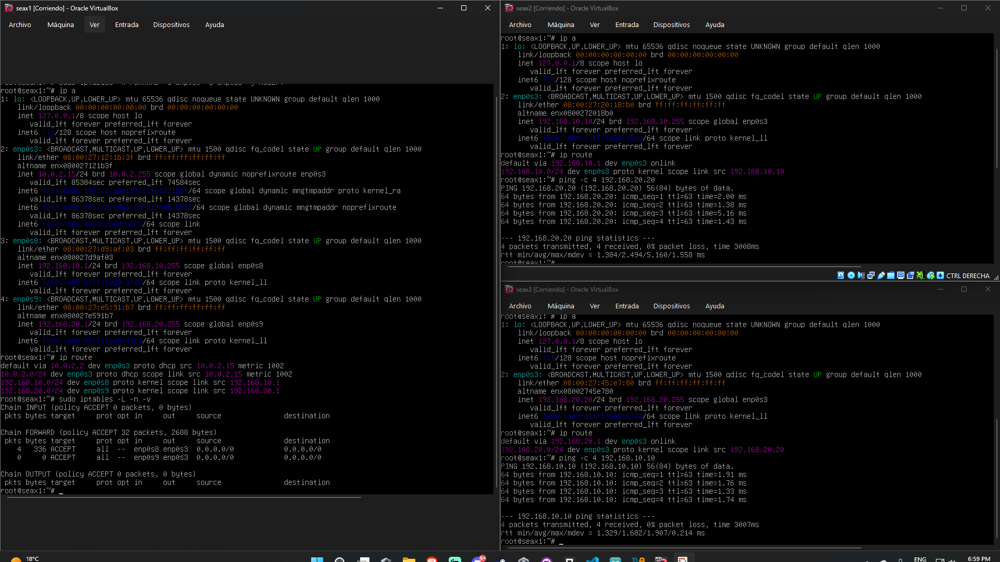

2. Cortafuegos (Firewalls) y NAT

---

Aquí es donde nos ponemos el escudo. El firewall es la aduana y el NAT es el "traductor" de direcciones.

* Teoría Clave:

Firewalls: Explica la diferencia entre Stateless (filtra paquetes sueltos) y Stateful (entiende el contexto de la conexión). Menciona las DMZ (Zonas Desmilitarizadas).

NAT (Network Address Translation): Crucial por la escasez de IPv4. Explica el PAT (Port Address Translation), que permite que toda tu casa/oficina salga a Internet con una sola IP pública.

* Parte Práctica Sugerida:

Usa iptables o nftables en Linux (o un firewall gráfico como pfSense).

Crea reglas para bloquear todo el tráfico entrante excepto el puerto 80 (HTTP) y 443 (HTTPS).

Configura una regla de Port Forwarding (NAT de destino) para que una petición externa llegue a un servidor web interno.

---

Fundamento teorico: 

Aunque el ruter sabe enviar paquetes, no tiene criterio para decidir que es peligroso y que no.

¿Que es un Firewall? 
Es un sistema que actua como barrera entre redes basandose en un conjunto de reglas. En Debian, el motor interno es Netfilter, y nosotros lo manejamos con la herramienta 'iptables' (o su sucesora 'nftables').

Las 3 cadenas basicas: 
* INPUT: Trafico que va hacia el ruter (ej: intentando entrar por ssh al router).
* OUTPUT: Trafico que sale desde el ruter.
* FORWARD: Trafico que cruza el ruter (el que va de una subred a otra). Esta es la mas importante para la seguridad de la red interna.

¿Que es el NAT? (Network Address Translation)
* Es el proceso de cambiar las direcciones IP en la cabecera de un paquete mientras viaja a traves de un ruter.
* SNAT/Masquerading: Permite que tus redes internas salgan a internet usando una IP publica.
* DNAT (Port forwarding): Permite que alguien desde fuera acceda a un servidor interno (ej: un servidor web en el Cliente A).

Parte practica: 

Todo esto se hace en la VM Router.

Activar el NAT (Masquerading):
Imaginemos que nuestro ruter tiene una tercera tarjeta de red conectada a Internet. 
Para que los Clientes A y B tengan internet debemos ejecutar:
```
sudo ipatbles -t nat -A POSTURING -o enp0s3 -j MASQUERADE
```
Cambia 'enp0s3' por el nombre de tu interfaz que tenga salida a internet.
Haciendo esto, el ruter enmascara las IPs privadas de los clientes y las sutituye por la suya propia al salir fuera.

Implementacion de una politica de Denegacion por defecto:
Un administrador experto no permite todo. Primero bloquea todo y luego abro solo lo necesario.

* Limpiar las reglas anteriores
```
sudo iptables -F
sudo iptables -X
```

* Politica por defecto (soltar todo)
```
sudo iptables -P INPUT DROP
sudo iptables -P FORWARD DROP
```

* Permitir que el ruter se vea a si mismo (loopback)
```
sudo iptables -A INPUT -i lo -j ACCEPT
```

* Perimtir ping entre las redes (solo entre las redes)
```
sudo iptables -A FORWARD -p icmp -j ACCEPT
```

* Permitir trafico de respuesta
```
sudo iptables -A FORWARD -m state --state ESTABLISHED,RELATED -j ACCEPT
```

Verificacion de la seguridad:
Para demostrar que el firewall funciona, haremos los siguiente
* Pruba de ping: haremos un ping de Cliente A al B (Deberia hace ping).
* Prueba de bloqueo: Intenta entrar por ssh desde el Cliente A al Cliente B 
    Deberia retornar un error de Timeout o simplemente no funcionar, ya que como no hemos puesto una regla que permita el puerto 22 (SSH) en la cadena de FORWARD, el firewall lo tira.
* Comando de verificacion en el Router:
```
sudo iptables -L -n -v
```



Ahora mismo tenemos una jaula donde los Clientes pueden hacerse ping entre ellos pero estos aun no pueden salir a navegar por internet.
Cosas que estan bien:
* El NAT (masquerade): Aun que no se ve en la captura anterior el comando ejecutado es el correcto para dar salida a internet. (Para ver el NAT ejecutaremos 'sudo iptables -t nat -L')
* Politicas DROP: Es excelente. Estás protegiendo el router y las redes de ataques externos.
* Loopback: Hemos permitido 'lo', lo cual es vital para que los procesos internos del propio Debian (Router) no fallen.



Para que los clientes puedan salir a navegar ejecutaremos los siguiente:
Permitir que las redes internas salgan a internet.
```
sudo iptables -A FORWARD -i enp0s8 -o enp0s3 -j ACCEPT
sudo iptables -A FORWARD -i enp0s9 -o enp0s3 -j ACCEPT
```
