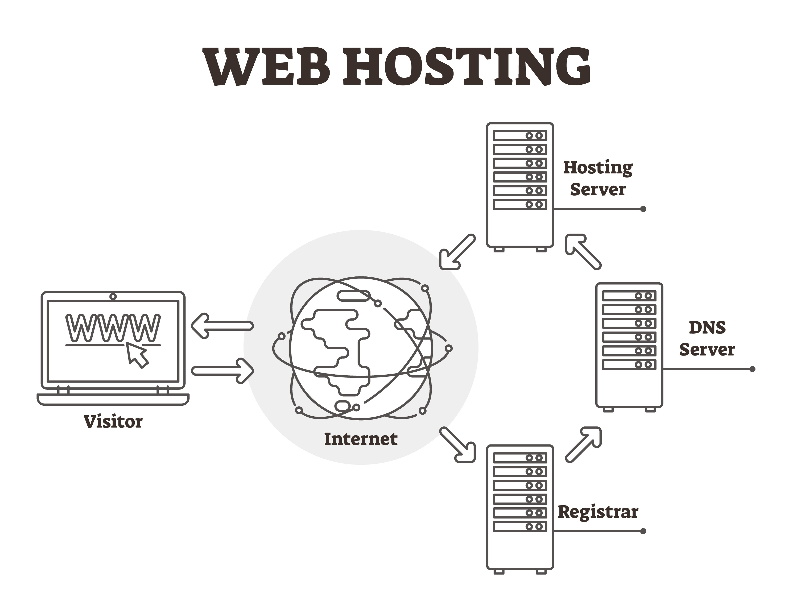
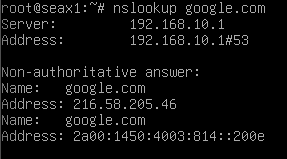

3. Servicios DNS (Domain Name System)

---

Sin DNS, tendrías que recordar que Google es 142.250.185.78. Es el "listín telefónico" de la red.

* Teoría Clave:

Jerarquía: Desde los servidores raíz (.) hasta los dominios de primer nivel (.com, .es) y los de segundo nivel.

Tipos de Registros: A (Nombre a IPv4), AAAA (Nombre a IPv6), MX (Correo) y CNAME (Alias).

Resolución: Diferencia entre consultas recursivas e iterativas.

* Parte Práctica Sugerida:

Instala y configura un servidor BIND9 en Ubuntu/Debian.

Crea una zona directa (nombre -> IP) y una zona inversa (IP -> nombre) para un dominio ficticio como miempresa.local.

Documentación: Uso de la herramienta dig o nslookup para verificar que el servidor responde correctamente.

---

Fundamento teorico: 

* Funcion: El DNS es un sistema jerarquico y distribuido que traduce nombres de dominio en direciones IP.
* Resolucion recursiva e iterativa: Nuestro router actuara como un resolutor recursivo, si no conoce una direccion, buscara en la jerarquia de internet hasta encontrarla y luego la guardara en su cache para acelerar futuras consultas.



* Registros esenciales: 
    * A: Traduce nombre a IPv4.
    * PTR: Registro inverso (traduce IP a nombre, vital para diagnosticos).
    * CNAME: Un alias para un nombre ya exsistente. 

Parte practica: 

Como ya tenemos internet en el Router (P2S2), vamos a convertirlo en el servidor DNS oficial de nuestras redes.

1- Instalacion
En el Router instalamos
```
sudo apt update && sudo apt install bind9 bind9utils bind9-doc
```

2- Configuracion de reenviadores (Forwarders)
Queremos que el router resuelva lo interno, pero que le pregunte a Google (8.8.8.8) lo externo. Para ello editaremos el archivo:
```
sudo nano /etc/bind/named.conf.options
```
En el archivo que sale escribiremos los siguiente (teniendo en cuenta que hay alguna parte que ya esta escrita de antemano).
```
acl "redes_internas" {
        127.0.0.0/8;
        192.168.10.0/24;
        192.168.20.0/24;
};

options {
        directory "/var/cache/bind";

        # Esto permite que tus clientes pregunten
        allow-query { "redes_internas"; };
        
        # Esto permite que el router busque la respuesta fuera
        recursion yes;

        forwarders {
                8.8.8.8;
                8.8.4.4;
        };

        dnssec-validation auto;
        listen-on-v6 { any; };
};
```

3- El firewall
Como antes hemos limpiado las reglas para que se pudiese hacer ping, ahora debemos proteger el servicio DNS. El DNS usa el puerto 53 (UDP y TCP). En el router ejecutaremos lo siguiente:
```
sudo iptables -A INPUT -p udp --dport 53 -s 192.168.10.0/24 -j ACCEPT
sudo iptables -A INPUT -p udp --dport 53 -s 192.168.20.0/24 -j ACCEPT
```

Validacion del DNS

En los clientes modificaremos su configuracion para que use el router como DNS, editaremos el archivo de configuracion resolv.conf:
```
sudo nano /etc/resolv.conf
# Cambiaremos lo que haya por:
nameserver 192.168.X.1 
```
X sera 10, 20 o el numero que estes usando.

Una vez modificado el archivo en el mismo cliente donde se haya modificado el archivo ejecutaremos:
```
nslookup google.com
```
Esto deberia retornar la IP de google. 


