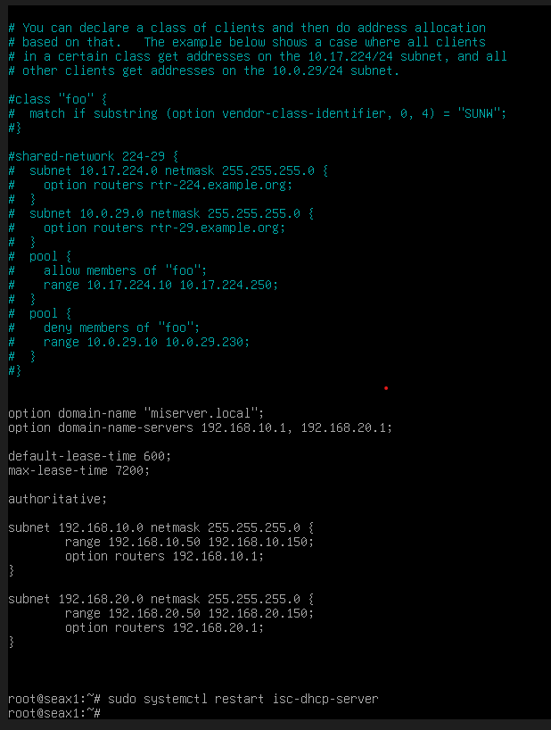
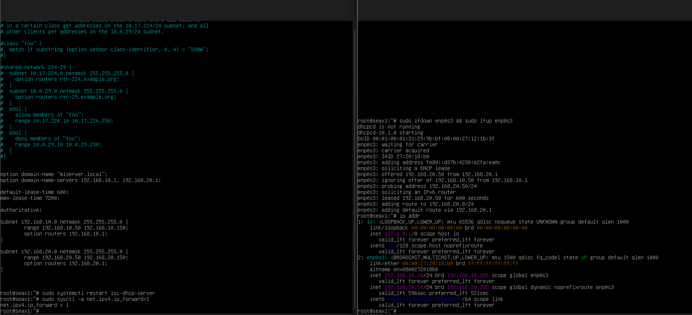
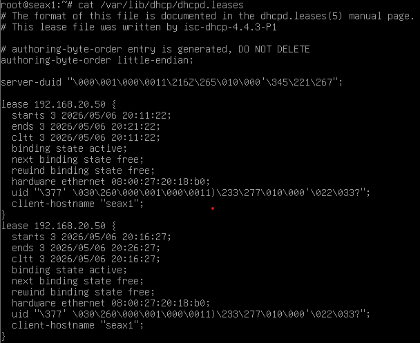

4. Servicios DHCP (Dynamic Host Configuration Protocol)

---

La automatización al servicio del administrador. Evita que tengas que ir ordenador por ordenador poniendo IPs a mano.

* Teoría Clave:

Proceso DORA: Explica las cuatro fases: Discover, Offer, Request y Acknowledge.

Parámetros: No solo da IPs, también entrega la máscara de subred, la puerta de enlace (Gateway) y los servidores DNS.

Reservas: Cómo asignar siempre la misma IP a una impresora o servidor basándose en su dirección MAC.

* Parte Práctica Sugerida:

Configura un servidor DHCP (puede ser el mismo Linux del DNS o un router Cisco).

Define un pool (rango) de direcciones (ej: 192.168.1.50 a 192.168.1.150).

Muestra cómo un cliente obtiene la IP automáticamente y cómo aparece en la tabla de "concesiones" (leases) del servidor.

---

Fundamento teorico: 

El servicio DHCP es el que permite que un dispositivo se conecte a una red y reciba automaticamente su direccion IP, la mascara, la puerta de enlace y los servidores DNS. Sin esto, tendriamos que ir ordenador por ordenador configurando todo a mano (como hemos hecho hasta ahora en las sesiones 1, 2, y 3).
* El proceso DORA: 
    * Discover: El cliente grita '¿Hay algun servidor DHCP?'
    * Offer: El servidor responde 'Yo estoy aqui y tengo esta IP para ti'
    * Request: El cliente dice 'Vale me quedo con esa IP'.
    * Acknowledge: El servidor confirma 'Hecho, es tuya por un tiempo'.

Parte practica: 

Vamos a configurar el router para que asigne IPs a las redes.

1- Instalacion
Ejecuta en la maquina router para instalar:
```
sudo apt update && sudo apt install isc-dhcp-server
```
NOTA: es probable que al terminar de instalar de un error, es normal porque aun no lo hemos configurado.

2- Definir las interfaces
Debemos decirle al router ahora por que tarjetas de red debe escuchar peticiones DHCP.
```
sudo nano /etc/default/isc-dhcp-server
```
Buscaremos la linea de interfaces y pondremos nuestras redes internas (en mi caso):
```
INTERFACESv4="enp0s8 enp0s9"
```

3- Configuracion de los rangos (Pools)
Vamos a editar el archivo principal para que ocurra la magia.
```
sudo nano /etc/dhcp/dhcpd.conf
```
Comentaremos el contenido que ya hay escrito y añadiremos la siguiente configuracion para nuestros dos clientes/redes internas:
```
option domain-name "miserver.local";
option domain-name-servers 192.168.10.1, 192.168.20.1;

default-lease-time 600;
max-lease-time 7200;

authoritative;

# Red A
subnet 192.168.10.0 netmask 255.255.255.0 {
  range 192.168.10.50 192.168.10.150;
  option routers 192.168.10.1;
}

# Red B
subnet 192.168.20.0 netmask 255.255.255.0 {
  range 192.168.20.50 192.168.20.150;
  option routers 192.168.20.1;
}
```
Una vez modificado tendremos que reiniciar el servicio.
```
sudo systemctl restart isc-dhcp-server
```



4- Verificacion 
Para ver si funciona, debemos hacer que nuestros clientes dejen de tener una IP estatica y pasen a automatica.
1- En uno de los clientes editamos el archivo '/etc/network/interfaces' y cambiamos la configuracion de la tarjeta enp0s3:
```
auto enp0s3
iface enp0s3 inet dhcp
```
2- Reiniciamos la red del cliente:
```
sudo ifdown enp0s3 && sudo ifup enp0s3 
```
3- Comprueba la IP: 
```
ip addr 
```
Si el cliente tiene una IP entre la .50 y la .150, felicidades el servicio DHCP ha funcionado.



Verificacion desde el router

Veamos que pone en el archivo de 'concesiones' en el router. Es donde el servidor anota a quien le ha dado cada IP
```
cat /var/lib/dhcp/dhcpd.leases
```

